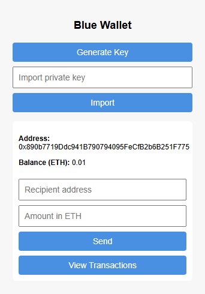
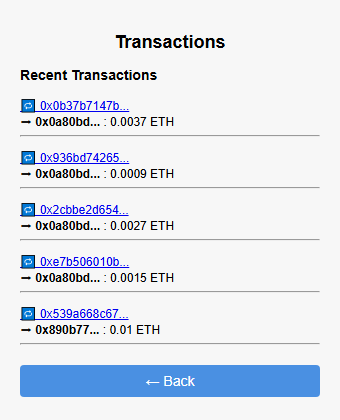

# Blue Wallet – Chrome Extension for Ethereum (Sepolia Testnet)

A lightweight Ethereum wallet built as a Chrome extension using **ethers.js** and the Sepolia testnet.  
Create, store, and manage Ethereum wallets directly from your browser.

---

## 🔐 Features

- Generate a new Ethereum wallet
- Import an existing private key
- Send ETH on the Sepolia testnet
- View recent transaction history (via Etherscan)
- Fully functional Chrome extension popup
- Secure storage using `chrome.storage`

---

## 🧱 Built With

- JavaScript (ES Modules)
- [ethers.js](https://docs.ethers.org/)
- Chrome Extensions API (Manifest v3)
- HTML + CSS (Vanilla)

---

## 📸 Screenshots

| Wallet View | Transaction History |
|-------------|---------------------|
|  |  |

---

## 🚀 Getting Started

### 1. Clone the repo

```bash
git clone https://github.com/mepho9/blue-wallet-chrome-extension.git
cd blue-wallet-chrome-extension
```
### 2. Install dependencies

```bash
npm install
```

### 3. Load the extension into Chrome

1) Open Chrome and go to `chrome://extensions`
2) Enable **Developer Mode**
3) Click **Load unpacked**
4) Select the `blue-wallet-chrome-extension/` project folder

---

## 🔧 How to Use

Once the extension is loaded:

1) Click the **Blue Wallet icon** in your browser toolbar.
2) On first launch, **click "Generate Key"** to create a new Ethereum address.
3) You can also import an existing private key (sepolia testnet only).
4) To **receive ETH**:
    1. Copy your wallet address and send Sepolia ETH to it
5) To **send ETH**, fill in:
    1. The recipient address
    2. The amount in ETH
    3. Then click **Send**
6) Click **View Transactions** to see your recent history (fetched via Etherscan API).

- All data is **stored locally using chrome.storage** and will persist between browser sessions.

